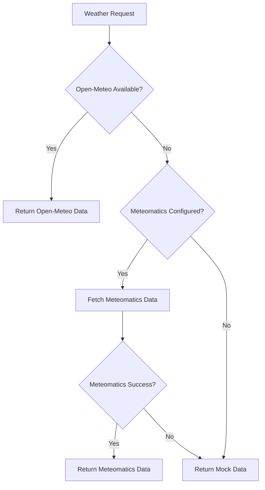

# Meteomatics API Integration Guide

## Overview

This document explains how the Meteomatics API is integrated into the AirAlert Pro system as a fallback weather data source.

## Integration Architecture

The system uses a hierarchical approach for weather data:

1. **Primary Source**: Open-Meteo (free API)
2. **Fallback Source**: Meteomatics (premium API)
3. **Final Fallback**: Mock data for development/testing

## Implementation Details

### API Module

The [meteomatics.py](backend/api meteomatics.py) module handles all interactions with the Meteomatics API:

- Authentication using basic auth (username/password)
- Current weather data retrieval
- Forecast data retrieval
- Error handling and fallback to mock data

### Fallback Mechanism

The [weather.py](backend/api weather.py) module implements the fallback logic:

1. Attempt to fetch data from Open-Meteo
2. If Open-Meteo fails, automatically try Meteomatics
3. If both fail, return mock data

### Configuration

API credentials are stored in environment variables:

```env
METEOMATICS_USERNAME=your_username
METEOMATICS_PASSWORD=your_password
```

## API Endpoints

### Test Endpoint

A test endpoint is available to verify the Meteomatics integration:

```
GET /api/test-meteomatics
```

This endpoint returns current weather data from Meteomatics or mock data if credentials are not configured.

## Data Flow



## Future Enhancements

1. **Enhanced Parsing**: Implement proper HTML/JSON parsing for Meteomatics responses
2. **Caching**: Add caching layer for weather data to reduce API calls
3. **Advanced Features**: Utilize Meteomatics' premium features like historical data and severe weather alerts
4. **Load Balancing**: Implement load balancing between multiple weather data sources

## Troubleshooting

### Common Issues

1. **Authentication Failure**: Verify username/password in environment variables
2. **API Limits**: Check Meteomatics subscription limits
3. **Network Issues**: Ensure backend can reach Meteomatics API endpoints

### Testing

Run the test script to verify integration:

```bash
python test_meteomatics.py
```

## Security Considerations

- Credentials are stored in environment variables, not in code
- API keys should be rotated regularly
- Monitor API usage to detect anomalies